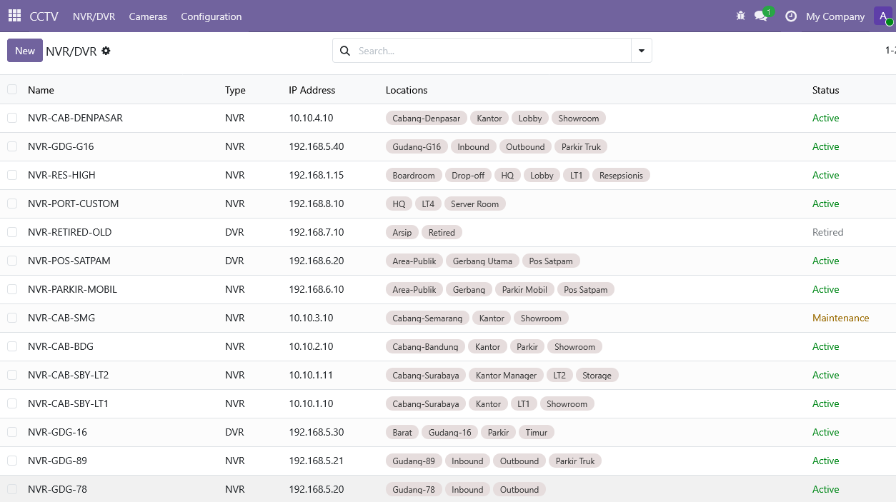
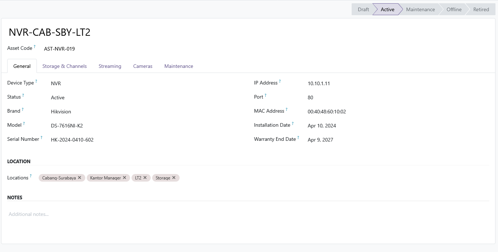

## CCTV Management

**Bahasa:** [🇬🇧 English](README.md) | [🇮🇩 Indonesia](README-id.md)

Addon Odoo 19 untuk inventaris dan manajemen NVR/CCTV perusahaan IT.

Bagian dari proyek [odoo-boilerplate](https://github.com/luridarmawan/odoo-boilerplate) untuk Odoo 19.

## Fitur

### Kemampuan Saat Ini (Fase 1)

- **Inventaris NVR/DVR** — Manajemen inventaris lengkap untuk Network Video Recorder dan Digital Video Recorder.
- **Identitas Perangkat** — Lacak setiap perangkat dengan kode aset unik, nomor seri, MAC address, dan IP address.
- **Spesifikasi Perangkat** — Catat brand, model, versi firmware, jumlah channel, kapasitas storage (TB), dan storage terpakai (TB).
- **Siklus Hidup Perangkat** — Kelola tanggal instalasi, tanggal berakhirnya garansi, dan status perangkat (`draft`, `active`, `maintenance`, `offline`, `retired`).
- **Konfigurasi Stream** — Simpan RTSP URL, stream URL, resolusi, frame rate, dan codec untuk setiap NVR.
- **Tagging Lokasi** — Sistem tagging fleksibel untuk lokasi, karena satu NVR dapat melayani kamera di beberapa lokasi berbeda.
- **Dashboard** — Daftar ringkasan perangkat NVR/DVR yang menampilkan nama, IP address, dan lokasi.
- **Security Group** — Kontrol akses berbasis peran dengan tiga tingkatan:
  - **CCTV User** — Melihat data dan laporan
  - **CCTV Supervisor** — Menambah, mengedit, dan mengelola maintenance
  - **CCTV Administrator** — Akses penuh
- **Desain Skalabel** — Dirancang untuk mendukung mulai dari puluhan hingga ribuan perangkat CCTV.

### Kemampuan yang Direncanakan (Fase 2 dan Seterusnya)

- **Inventaris Kamera CCTV** — Manajemen siklus hidup kamera lengkap yang terhubung ke NVR induk.
- **Inventaris PoE Switch** — Pelacakan infrastruktur jaringan untuk switch PoE.
- **Integrasi ONVIF** — Penemuan dan konfigurasi perangkat secara otomatis.
- **Integrasi RTSP** — Pengambilan dan validasi live stream.
- **Peta Lokasi** — Visualisasi geografis penempatan CCTV.
- **Tampilan Floor Plan** — Tata letak perangkat berbasis gedung/lantai.
- **Monitoring Otomatis** — Pengecekan kesehatan berkala untuk NVR dan kamera.
- **Monitoring Storage** — Pelacakan kapasitas storage NVR secara real-time.
- **Integrasi Alert**:
  - Notifikasi Telegram
  - Notifikasi WhatsApp
  - Notifikasi Email
- **AI Analytics** — Deteksi kejadian dan alert cerdas.
- **Face Recognition** — Analitik video berbasis pengenalan wajah.
- **License Plate Recognition (LPR)** — Identifikasi kendaraan di titik masuk/keluar.

### Struktur Modul

```
cctv_management/
├── models/      # Model ORM (contoh: cctv.nvr)
├── views/       # View tree, form, search, dan menu
├── security/    # Access rights, security group, record rule
├── data/        # Data default dan demo
├── report/      # Report PDF dan QWeb
├── wizard/      # Transient model untuk workflow terpandu
├── static/      # Aset (CSS, JS, gambar)
└── tests/       # Unit dan integration test
```

### Highlight Teknis

- Dibangun di atas **Odoo 19** menggunakan **ORM** (tanpa SQL langsung).
- Constraint dan validasi untuk integritas data.
- Computed field jika diperlukan.
- Help text pada field penting untuk UX yang lebih baik.
- Selection field untuk enumerasi tetap.
- Schema yang kompatibel ke depan untuk mendukung seluruh fitur yang direncanakan tanpa perubahan yang merusak.

## Screenshot

### Dashboard



### Detail NVR




## Instalasi

### Instalasi Tradisional

1. Salin folder ini ke direktori addons Odoo Anda:

```bash
cp -r device_management /path/to/odoo/addons/
```

2. Restart layanan Odoo:

```bash
sudo systemctl restart odoo
# atau
sudo service odoo restart
```

3. Buka Odoo, aktifkan *Developer Mode* (Settings → Activate Developer Mode).

4. Buka **Apps → Update Apps List**.

5. Cari **Device Management**, lalu klik **Install**.

### Alternatif via Git Clone

```bash
cd /path/to/odoo/addons
git clone <repo-url> device_management
```

Lanjutkan ke langkah 2-5 di atas.

### Instalasi Docker

Jika Anda menggunakan [odoo-boilerplate](https://github.com/luridarmawan/odoo-boilerplate) dengan Docker:

1. Clone repositori ini ke direktori `addons/`:

```bash
cd /path/to/odoo-boilerplate/addons
git clone <repo-url> cctv_management
```

2. Restart container Docker:

```bash
docker compose restart
```

3. Buka Odoo, aktifkan *Developer Mode* (Settings → Activate Developer Mode).

4. Buka **Apps → Update Apps List**.

5. Cari **CCTV Management**, lalu klik **Install**.
